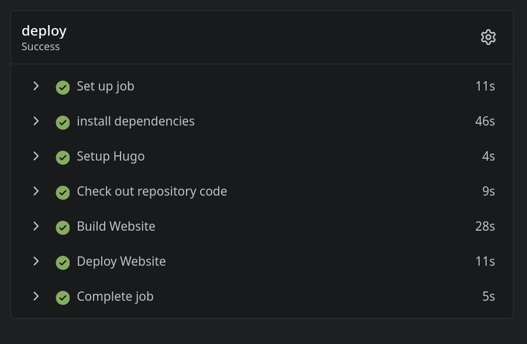

> Ich könnte mal eine Website mit dem Ziel eines professionellen Profils erstellen,...
> statt immer wieder pseudonyme Spielprojekte dahin umzubiegen.

Und so entstand [maklem.eu](/), ein weiteres Spielprojekt.

Ich habe mir wohl unnötig lange den Kopf zerbrochen... 
Nutze ich einen VPS? Und wenn ja, welche der vielen Varianten? Oder meinen bisherigen Webspace?
Oder meinen RasPi im HomeLab? Oder Git-Pages (über GitHub oder Codeberg)?

... und wo registriere ich die Domain? Da wo ich schon mehrere Domains habe? Oder eher woanders?

... und was mache ich mit Emails? Ein weiterer Account? Oder per MX-Record zum Webspace in den aktuellen Account? Oder erstmal garnicht?

Fragen über Fragen.

Für den Start habe ich mich nun für ein 100mb-Angebot entschieden.
Eine statische Seite mit [Hugo](https://gohugo.io) und [Blowfish](https://blowfish.page/) braucht ja nicht so viel. Und die aktuellen paar Bilderchen auch nicht.

Und das Deployment läuft über CI! 🥳 ... im 20. Versuch oder so.

(Die ganzen älteren Beiträge habe ich auf anderen Platformen geschrieben und umgezogen. So sieht es nicht so leer aus.)

